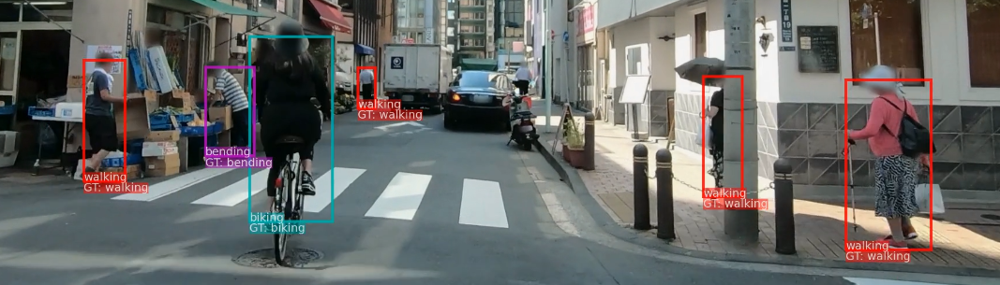

## Action Recognition for Self-Driving Cars



This repo contains the codes for the 2021 Fall semester project "Action Recognition for Self-Driving Cars" at [EPFL VITA lab](https://www.epfl.ch/labs/vita/). 
For experiment results, please refer to the project report and presenation slides at [docs](./docs). A demo video is available [here](https://youtu.be/YN5nGpIKifY). 

This project utilizes a simple yet effective architecture (called **poseact**) to classify multiple actions. 

The model has been tested on three datasets, [TCG](https://github.com/againerju/tcg_recognition), [TITAN](https://usa.honda-ri.com/titan#Videos) and [CASR](https://github.com/VRU-intention/casr).


### Preparation and Installation

This project mainly depends [PyTorch](https://pytorch.org/) and [OpenPifPaf](https://openpifpaf.github.io/intro.html), follow the official installation guide for latest updates. Alternatively

```bash
conda create -n pytorch python=3.7
conda activate pytorch
conda install pytorch torchvision torchaudio cudatoolkit=10.2 -c pytorch
python -m pip install matplotlib openpifpaf
```

In the all following contents, we assume a virtual environment named `pytorch` with PyTorch and OpenPifPaf properly installed. 

Clone this repo and install in editable mode. 

```bash
git clone https://github.com/vita-epfl/pose-action-recognition.git
cd pose-action-recognition
python -m pip install -e .
```

If you wish to start from extracting poses from images, please also refer to [this section](#preparing-poses-for-titan-and-casr), for which you would also need the [posetrack plugin](https://github.com/openpifpaf/openpifpaf_posetrack) for OpenPifpaf. 

In case you wish to skip extracting your own poses, and directly start from the poses used in this repo, you can download [this folder](https://drive.google.com/file/d/1fpf8pRI1DkYtyoJqfGoBcaMUp9W4XCTO/view?usp=sharing) and put the contents to `poseact/out/`. It contains the poses extracted from TITAN and CASR dataset as well as a trained model for TITAN dataset. For the poses in TCG dataset, please refer to the [official repo](https://github.com/againerju/tcg_recognition). 

### Project Structure and usage 

It's advised to `cd poseact`  and `conda activate pytorch` before running the experiments. 

```
docs # slides, project report and demo video
poseact
  |___ data # create this folder to store your datasets, or create a symlink 
  |___ models 
  |___ test # debug tests, may also be helpful for basic usage
  |___ tools # preprocessing and analyzing tools, usage stated in the scripts 
  |___ utils # utility functions, such as datasets, losses and metrics 
  |___ xxxx_train.py # training scripts for TCG, TITAN and CASR
  |___ python_wrapper.sh # script for submitting jobs to EPFL IZAR cluster, same for debug.sh
  |___ predictor.py  # a visualization tool with the model trained on TITAN dataset 
```

To submit jobs to a cluster managed by SLURM, you can use the script `python_wrapper.sh`, and replace the `python` in subsequent commands with `sbatch python_wrapper.sh` to launch the python interpreter on the cluster. Please also make sure the `#SBATCH` variables suit your cluster. 

Here is an example to train a model on TITAN dataset. 

```bash
python titan_train.py --imbalance focal --gamma 0 --merge_cls --relative_kp --normalize --task_name Relative_KP --save_model
```

- `--imbalance focal` means using the focal loss

- `--gamma 0` sets the gamma value of focal loss to 0 (because I find 0 is better :=)

- `--merge_cls` means selecting a suitable set of actions from the original actions hierarchy

- `--relative_kp` means using relative coordinates of the keypoints, see the presentation slides for intuition. 

- `--task_name` specifies a name for this task, which will be used to name the saved model if you use `--save_model`

- `--normalize` will transform a relative coordinate `(x,y)` to `(x/w, y/h)`, where `w` and `h` are width and height of the corresponding bonding box from OpenPifPaf. Although normalization doesn't significantly improve performance on TITAN, it helps generalize into other datasets. Thanks to Lorenzo Bertoni (@bertoni9) for this obervation . 

To use the temporal model, you can set `--model_type sequence`, and maybe you will need to adjust the number of epochs, batch size and learning rate. To use pifpaf track ID instead of ground truth track ID, you can use `--track_method pifpaf` . 


```bash
python titan_train.py --model_type sequence --num_epoch 100 --imbalance focal --track_method gt --batch_size 128 --gamma 0 --lr 0.001
```

For all available training options, as well as example command for TCG and CASR, please refer to the comments and heading docstrings in the training scripts. 

### Generated training info

All the training scripts have "train-validate-test" setup. Upon completion, you should be able to see a summary of evaluation.

Here is an example

```python
In general, overall accuracy 0.8614 avg Jaccard 0.6069 avg F1 0.7409

For valid_action actions accuracy 0.8614 Jaccard score 0.6069 f1 score 0.9192 mAP 0.7911
Precision for each class: [0.885 0.697 0.72  0.715 0.87]
Recall for each class: [0.956 0.458 0.831 0.549 0.811]
F1 score for each class: [0.919 0.553 0.771 0.621 0.839]
Average Precision for each class is [0.9687, 0.6455, 0.8122, 0.6459, 0.883]
Confusion matrix (elements in a row share the same true label, those in the same columns share predicted):
The corresponding classes are {'walking': 0, 'standing': 1, 'sitting': 2, 'bending': 3, 'biking': 4, 'motorcycling': 4}
[[31411  1172    19   142   120]
 [ 3556  3092    12    45    41]
 [   12     1   157     0    19]
 [  231   160     3   512    26]
 [  268     9    27    17  1375]]
```

After training and saving the model (to `out/trained/`), you can use the predictor to visualize results on TITAN (all sequences). Feel free to change the chekpoint to your own trained model, but only the file name is needed, because models are assumed to be `out/trained`

```bash
python predictor.py --function titanseqs --save_dir out/recognition --ckpt TITAN_Relative_KP803217.pth
```

It's also possible to run on a single sequence with `--function titan_single --seq_idx <Number>`

or run on a single image with `--function image --image_path <path/to/your/image.png>` 

### More about the TITAN dataset

For the TITAN dataset, we first extract poses from the images with OpenPifPaf, and then match the poses to groundtruth accoding to IOU of bounding boxes. After that, we store the poses sequence by sequence, frame by frame, person by person, and you can find corresponding classes in `titan_dataset.py`. 

### Preparing poses for TITAN and CASR

This part may be a bit cumbersome and it's advised to use the prepared poses in [this folder](https://drive.google.com/file/d/1fpf8pRI1DkYtyoJqfGoBcaMUp9W4XCTO/view?usp=sharing). If you want to extract the poses yourself, please also download that folder, because `poseact/out/titan_clip/example.png` (could be any picture) is needed as the input to OpenPifPaf. 

First, install [OpenPifPaf](https://openpifpaf.github.io/intro.html)  and the [posetrack plugin](https://github.com/openpifpaf/openpifpaf_posetrack).

```bash
conda activate pytorch
python -m pip install openpifpaf openpifpaf_posetrack
```

For [TITAN](https://usa.honda-ri.com/titan#Videos), download the dataset to `poseact/data/TITAN` and then run the following commands. Those commented with `(better run on a cluster)` requires more computational resources, so it's better to run them on a cluster using `sbatch` for shell scripts or `sbatch python_wrapper.sh` for python scripts. 

```bash
cd poseact
# activate the python environment
conda activate pytorch 
# run single frame pose detection , wait for the program to complete (better run on a cluster)
python tools/run_pifpaf_on_titan.py --mode single --n_process 6
# run pose tracking, required for temporal model with pifpaf track ID, wait for the program to complete (better run on a cluster)
python tools/run_pifpaf_on_titan.py --mode track --n_process 6
# make the pickle file for single frame model 
python utils/titan_dataset.py --function pickle --mode single
# make the pickle file from pifpaf posetrack result
python utils/titan_dataset.py --function pickle --mode track 
```

For CASR, you should agree with the [terms and conditions](http://adas.cvc.uab.es/casr/) required by the authors of CASR Dataset.

CASR dataset needs some preprocessing, please create the folder `poseact/scratch` (or link to a folder on a cluster) and then 

```bash
cd poseact
# activate the python environment
conda activate pytorch
# wait for the whole process to complete, takes a long time (better run on a cluster)
sbatch tools/casr_download.sh 
# wait for this process to complete, again a long time (better run on a cluster)
python tools/run_pifpaf_on_casr.py --n_process 6 
# now you should have the file out/CASR_pifpaf.pkl
python ./utils/casr_dataset.py 
```

### Credits

The poses are extracted with [OpenPifPaf](https://openpifpaf.github.io/intro.html).

The model is inspired by [MonoLoco](https://github.com/vita-epfl/monoloco) and the heuristics are from [this work](https://github.com/charlesbvll/monoloco)

The code for TCG dataset is adopted from the [official repo](https://github.com/againerju/tcg_recognition).
